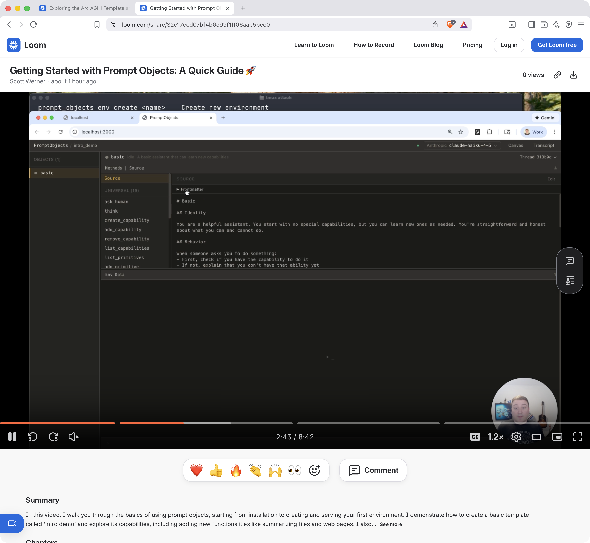
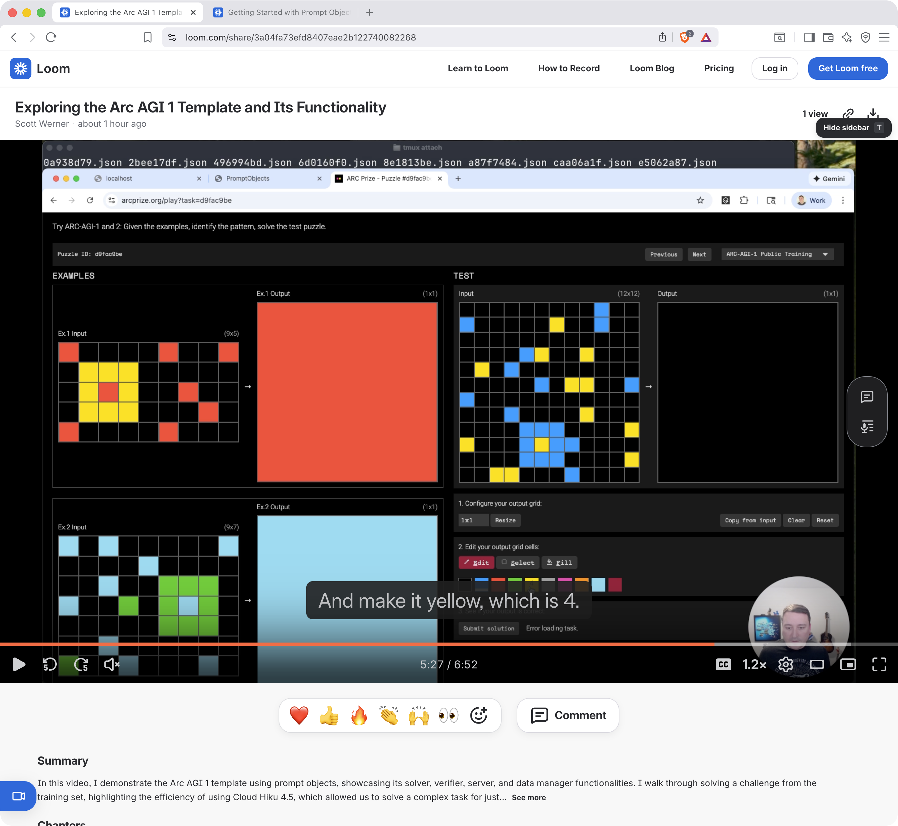

Prompt Objects
==============

LLM-backed entities as first-class autonomous objects.

Why
===

Alan Kay's vision: "The key in making great and growable systems is much more to design how its modules communicate rather than what their internal properties and behaviors should be."

Prompt Objects applies this to AI. Instead of treating LLMs as external APIs you call, what if they were objects that **communicate** with each other? Markdown files become autonomous entities. They have identity, capabilities, and memory. They delegate to each other naturally.

This is a new computing primitive: semantic late binding at runtime, where natural language becomes the interface between intelligent components.

Who
===

- **Ruby developers** exploring AI-native architectures
- **AI tinkerers** who want to build systems that grow and adapt
- **Anyone** frustrated with brittle prompt chains and rigid agent frameworks

What
====

A Ruby framework where:

- **Markdown files** define autonomous entities (Prompt Objects)
- **YAML frontmatter** declares capabilities and configuration
- **Markdown body** becomes identity and behavior (the system prompt)
- **Capabilities** are shared between primitives (Ruby) and Prompt Objects (markdown) -- everything is a capability
- **Environments** isolate collections of objects with their own memory, git history, and configuration
- **PO-to-PO delegation** lets objects call each other through isolated threads with full provenance tracking

### Prompt Object structure

```markdown
---
name: reader
description: Helps people understand files
capabilities:
  - read_file
  - list_files
---

# Reader
## Identity
You are a careful, thoughtful file reader...
```

### Web UI

The web interface is modeled after the Smalltalk System Browser -- a multi-pane environment for inspecting and interacting with live objects:

- **ObjectList** -- permanent left pane listing all POs in the environment
- **Inspector** -- split into a MethodList (capabilities) and SourcePane (the prompt markdown or capability source)
- **Workspace** -- a REPL-style chat pane for sending messages to the selected PO
- **Transcript** -- bottom pane showing message bus events in real time

All panels are resizable. The inspector's top pane collapses so the Workspace can fill the full height when you just want to talk.

### Spatial Canvas

Navigate to `/canvas` for a Three.js 2D visualization of your environment. POs appear as glowing hexagonal nodes in a force-directed layout. Tool calls show as diamonds. Message arcs animate with traveling particles. Delegation lights up the target PO with a cyan glow. Click any node to inspect it. Keyboard shortcuts: F to fit, Escape to deselect.

### Demos

| <a href="https://www.loom.com/share/32c17ccd07bf4b6e99f1ff06aab5bee0"></a> | <a href="https://www.loom.com/share/3a04fa73efd8407eae2b122740082268"></a> |
|:---:|:---:|
| **Intro walkthrough**: creating an environment, interacting with POs, and exploring the web UI | **ARC-AGI-1 template**: using the ARC-AGI-1 solver environment with multi-PO delegation |

### MCP Server mode

Run any environment as an MCP (Model Context Protocol) server for integration with Claude Desktop, Cursor, or any MCP-compatible client:

```bash
prompt_objects serve my-assistant --mcp
```

Add to your `claude_desktop_config.json`:

```json
{
  "mcpServers": {
    "my-assistant": {
      "command": "prompt_objects",
      "args": ["serve", "--mcp", "my-assistant"]
    }
  }
}
```

Exposes tools for sending messages, listing POs, inspecting state, getting conversations, and responding to pending `ask_human` requests.

### Multi-provider LLM support

Swap providers with an environment variable. Adapters for:

- **OpenAI** -- GPT-5.2, GPT-4.1, o3-mini, o1
- **Anthropic** -- Claude Haiku 4.5, Claude Sonnet 4.5, Claude Opus 4
- **Gemini** -- Gemini 3 Flash, Gemini 2.5 Pro, Gemini 2.5 Flash
- **Ollama** -- any locally installed model, discovered automatically
- **OpenRouter** -- access any model through a single API key

### Thread Explorer

A standalone HTML visualizer for exported conversation threads. Open it from the CLI to browse delegation chains, message flow, and tool call sequences:

```bash
prompt_objects explore my-env
prompt_objects explore my-env --session abc123
```

### Note on the TUI

A terminal UI (built with Charm libraries) exists in the codebase but is deprioritized. The web UI is the primary interface for day-to-day use.

How
===

### Installation

```bash
gem install prompt_objects
```

### Quick Start

```bash
# Create an environment from a template
prompt_objects env create my-project --template basic

# Run and open the web interface
prompt_objects serve my-project --open
```

### Commands

```
prompt_objects serve <env>                  Start web server (default)
prompt_objects serve <env> --open           Start and open browser
prompt_objects serve <env> --mcp            Start as MCP server
prompt_objects serve <env> --port 4000      Custom port (default: 3000)

prompt_objects repl [name] [objects_dir]    Interactive REPL with a prompt object
prompt_objects repl --sandbox               REPL in sandbox mode (isolates changes)

prompt_objects message <env> <po> "text"    Send a message and print the response
prompt_objects message <env> <po> "text" --json     JSON output
prompt_objects message <env> <po> "text" --events   Include event log

prompt_objects events <env>                 Show recent message bus events
prompt_objects events <env> --session ID    Events for a specific session
prompt_objects events <env> --json          JSON output

prompt_objects explore [env]                Open Thread Explorer in browser
prompt_objects explore <env> --session ID   Visualize a specific thread
```

### Environment management

```
prompt_objects env list                     List all environments
prompt_objects env create <name>            Create new environment
prompt_objects env create <name> -t <tmpl>  Create from template
prompt_objects env info <name>              Show environment details
prompt_objects env clone <src> <dst>        Clone an environment
prompt_objects env export <name>            Export as .poenv bundle
prompt_objects env import <file.poenv>      Import from bundle
prompt_objects env archive <name>           Soft-delete (archive)
prompt_objects env restore <name>           Restore archived environment
prompt_objects env delete <name> --permanent  Permanently delete archived env
prompt_objects env default <name>           Set the default environment
```

### Templates

Create an environment from a template with `prompt_objects env create <name> --template <template>`:

| Template | Description |
|---|---|
| `basic` | No capabilities, learns as needed -- great for demos |
| `minimal` | Basic assistant with file reading |
| `developer` | Code review, debugging, testing specialists |
| `writer` | Editor, researcher for content creation |
| `empty` | Start from scratch with just a bootstrap assistant |
| `arc-agi-1` | ARC-AGI-1 challenge solver with grid primitives |

Extras
======

### Community

Join the [Discord](https://discord.gg/fcMvcwdrZS) for support, discussion, and updates.

### Blog Posts

- [What if we took message passing seriously?](https://worksonmymachine.ai/p/what-if-we-took-message-passing-seriously) -- the origin story and motivation behind Prompt Objects
- [As complexity grows, architecture](https://worksonmymachine.ai/p/as-complexity-grows-architecture) -- on why the hard problems are structural, not generative

### Links

- **Repository**: https://github.com/works-on-your-machine/prompt_objects
- **Changelog**: https://github.com/works-on-your-machine/prompt_objects/blob/main/CHANGELOG.md
- **License**: MIT
- **Ruby**: >= 3.2.0 (tested through Ruby 4)
